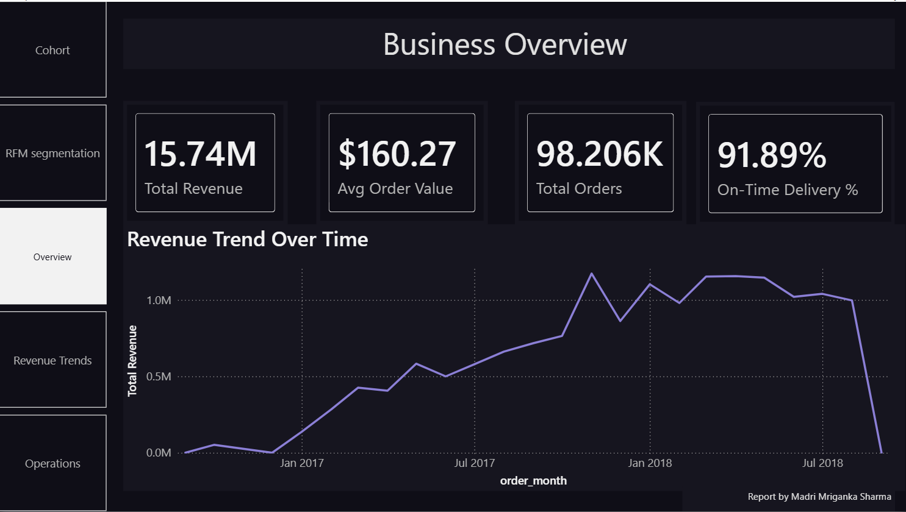
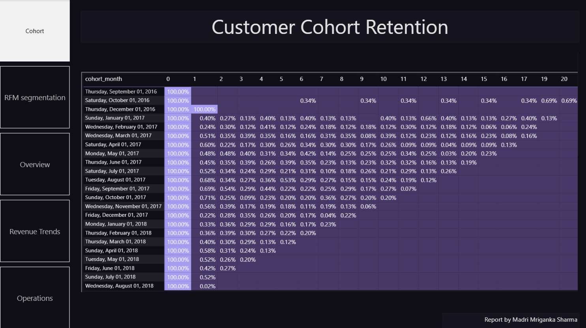
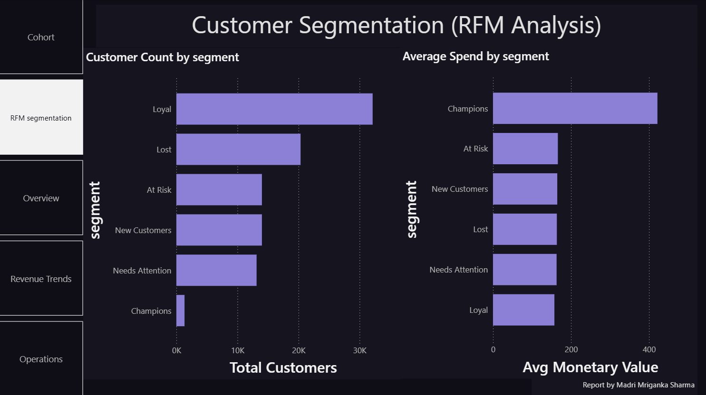
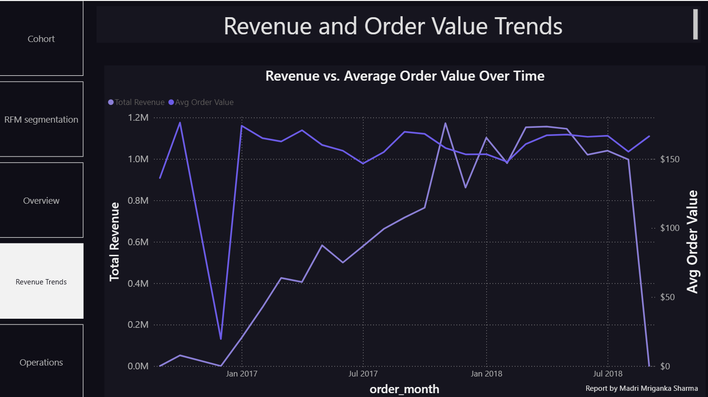
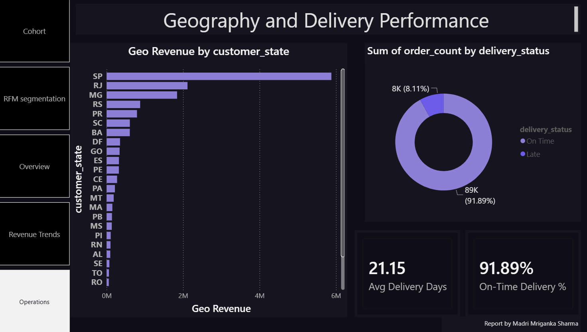

# Customer Retention & Business Intelligence Analysis | End-to-End SQL + Power BI Project

**MySQL · Power BI (DAX) · Customer Cohort & RFM Segmentation · Revenue, Geography & Delivery Analytics**

---

## Executive Snapshot (3-Minute Read)

**Business Context**
This project analyzes ~99,000 orders from a Brazilian e-commerce marketplace (Olist) to answer four connected business questions: how well the business retains customers, which customer segments are most valuable, where revenue is concentrated geographically, and how reliably orders are delivered. The goal is to identify where retention and operational investment will have the highest return.

### Dashboard Walkthrough

## Key Findings
- The business generated **$15.74M in total revenue** across **98,206 orders**, at an average order value of **$160.27**
- Revenue grew steadily from late 2016 through 2018, and in the later period growth was increasingly driven by **rising average order value**, not just order volume
- **Champions** — customers with the best recency, frequency, and monetary scores — are only **1,338 customers (1.4% of the customer base)** but spend **$421.64 on average, over 2.5x** every other segment
- **"Lost" and "At Risk" customers combined make up 36% of the customer base** (34,355 customers), and their average spend ($163–$166) is not meaningfully lower than active segments — meaning this is a real win-back opportunity, not a low-value group
- **São Paulo (SP)** dominates every other state, generating **$5.88M in revenue from 41,126 orders** — roughly **2.8x more than the second-highest state**
- **91.89% of orders were delivered on time**; the 8.11% delivered late took **nearly 3x longer on average** (31.5 days vs. 10.8 days) — a clear, specific operational issue
- Repeat purchasing in this dataset is genuinely low — most customers buy once. Cohort retention beyond month 0 is under 1% in almost every case, which is a real characteristic of this marketplace, not a data error (see *Key Analytical Decisions* below)

**Why This Matters**
Aggregate revenue numbers hide where the real leverage is. This analysis shows that a very small segment (Champions) drives outsized value, that a large share of the customer base (At Risk + Lost) is dormant but not low-value, that revenue is geographically concentrated in one state, and that a specific, measurable delivery problem (late orders taking 3x longer) is degrading customer experience for roughly 1 in 12 orders.

## Actionable Recommendations
- **Launch a targeted win-back campaign for the "At Risk" segment.** Given their historical spend is close to the customer average, even a modest reactivation rate represents meaningful recovered revenue.
- **Investigate the root cause of late deliveries.** An 8.1% late rate with nearly 3x longer delivery time suggests a specific bottleneck (carrier, region, or product category) rather than random variation — worth a focused root-cause query.
- **Study what is driving São Paulo's outsized performance** and assess whether it is replicable in other high-potential states, or whether the business should intentionally concentrate further marketing spend there.
- **Treat "Champions" as a retention-first, not acquisition-first, priority** — they are a very small group generating disproportionate revenue; even small increases in their retention or frequency would have an outsized revenue impact.

> *Note: The dataset's final month (September 2018) contains only 1 order and was excluded from trend interpretation, as it represents an incomplete observation window rather than a real decline. Cohort retention percentages for the earliest (2016) and most recent cohorts are based on very small sample sizes and should be read with that in mind.*

---

## 📌 Project Overview

This project delivers an end-to-end analysis using **MySQL** for data modeling and analysis, and **Power BI** for visualization, on the **Olist Brazilian E-Commerce** dataset (~99,000 orders, ~99,000 customer records, ~95,000 unique customers).

The business question: *"Which customers, regions, and operational areas should the business prioritize to grow revenue and improve retention?"*

The analysis is organized into five focus areas, each built as its own dashboard page: **Business Overview**, **Customer Cohort Retention**, **Customer Segmentation (RFM)**, **Revenue & Order Value Trends**, and **Geography & Delivery Performance**.

---

## 📊 Executive Summary

### Business Overview
- Total Revenue: **$15.74M** | Total Orders: **98,206** | Avg Order Value: **$160.27** | On-Time Delivery: **91.89%**
- Revenue trended upward through the dataset's active period, with a visible peak around November 2017

Implication: The business shows healthy, consistent growth with a clear seasonal spike worth investigating for replicable promotional timing.

### Cohort Retention
- Nearly all cohorts show 100% "retention" at month 0 (by definition — this is when the cohort is created) and then drop sharply, generally to under 1% by month 1
- This pattern holds consistently across almost every monthly cohort from 2016 through 2018

Implication: This marketplace is dominated by one-time buyers. Retention strategy should focus on converting *first-time* buyers into a *second* purchase, rather than optimizing long-term loyalty programs, since the drop-off happens almost entirely at the first repeat-purchase opportunity.

### Customer Segmentation (RFM)
- Segment breakdown: Loyal (32,145 / 33.8%), Lost (20,343 / 21.4%), At Risk (14,012 / 14.8%), New Customers (14,012 / 14.8%), Needs Attention (13,139 / 13.8%), Champions (1,338 / 1.4%)
- Champions average $421.64 in spend vs. $157–$166 for every other segment

Implication: Value is highly concentrated. A small, identifiable group of customers drives outsized revenue, while over a third of the customer base is dormant with recoverable value.

### Revenue & Order Value Trends
- Average Order Value was volatile and comparatively low through 2016–early 2017, then rose and converged with overall revenue growth through 2018

Implication: Later-stage revenue growth was increasingly driven by customers spending more per order, not just by acquiring more customers — a healthy sign for unit economics.

### Geography & Delivery Performance
- São Paulo generated $5.88M in revenue (41,126 orders) — more than the next several states combined
- 91.89% on-time delivery; late orders averaged 31.5 days vs. 10.8 days for on-time orders

Implication: Revenue is geographically concentrated, and there is a clear, quantifiable delivery-time gap for the minority of orders that arrive late.

---

## 🧠 Key Analytical Decisions

*The judgment calls that shaped this analysis — not just what was done, but why.*

- **Cohort and RFM analysis used `customer_unique_id`, not `customer_id`.** Olist's `customer_id` is generated per order rather than per person — an initial version of the cohort table using `customer_id` showed zero repeat purchases across the entire dataset, which was a signal of an identifier problem rather than a real business finding. Switching to `customer_unique_id` (Olist's true person-level identifier) revealed real, if low, repeat-purchase behavior. This distinction is documented because it materially changes the analysis and is an easy mistake to make with this dataset.
- **Cohorts were anchored to first purchase month, not a separate signup date**, since Olist has no signup event distinct from a first order. This slightly understates true customer lifetime for anyone who browsed before their first purchase, but is the most defensible proxy available in the data.
- **NTILE(4) was used for RFM scoring instead of fixed thresholds.** Manual cutoffs (e.g., "recency under 30 days = high") are arbitrary and dataset-specific. `NTILE()` splits customers into quartiles based on this dataset's actual distribution, making the segmentation adaptive rather than hardcoded to assumptions from a different business context.
- **Canceled and unavailable orders were excluded** from cohort, revenue, and RFM calculations, since they do not represent completed transactions. This removed a very small share of orders (about 1.2% combined) and did not materially affect overall figures.
- **The cohort retention table was built in long format (cohort_month, month_number, active_customers) in SQL, with the pivot into a matrix handled by Power BI**, rather than pivoting rows into columns in SQL. This keeps the SQL layer simpler, more readable, and more reusable for other visualization tools if needed later.
- **Delivery performance was summarized by status (On Time / Late) rather than as a single blended average**, because averaging across the full order set would have masked the real story: late orders are not modestly slower, they take nearly 3x as long, which is the more actionable finding.

---

## 🔍 Data Quality Audit Summary

| Table | Issue | Finding | Action |
|---|---|---|---|
| orders | Non-completed order statuses (canceled, unavailable) | 1,234 of 99,441 orders (~1.2%) | Excluded from cohort, revenue, and RFM calculations |
| customers | Order-scoped vs. person-scoped identifier | `customer_id` is unique per order, not per person | Cohort and RFM logic rebuilt using `customer_unique_id` after initial `customer_id`-based cohort table showed no repeat purchases |
| orders | Incomplete final month in dataset | September 2018 contains a single order | Excluded from trend interpretation as an incomplete observation window |
| orders | Missing delivery dates for non-delivered orders | Present for orders not yet delivered | Filtered to `order_status = 'delivered'` for delivery performance analysis |

SQL scripts: [`sql/01_schema_setup.sql`](sql/01_schema_setup.sql) · [`sql/02_cohort_analysis.sql`](sql/02_cohort_analysis.sql) · [`sql/03_rfm_segmentation.sql`](sql/03_rfm_segmentation.sql) · [`sql/04_additional_analysis.sql`](sql/04_additional_analysis.sql)

Power BI dashboard: [`dashboard/cohort_retention.pbix`](dashboard/cohort_retention.pbix)

---

## 🛠️ Tools Used

- **MySQL** — Data modeling, cohort table construction (CTEs, window functions), RFM segmentation (`NTILE`, `CASE WHEN`), revenue/geography/delivery analysis
- **Power BI** — Multi-page interactive dashboard (DAX measures, conditional-formatted retention matrix, custom dark theme, page navigation)

---

## ⚠️ Assumptions & Caveats

- Cohorts are anchored to first purchase month, not a true signup date (see *Key Analytical Decisions*)
- The dataset's final month is excluded from trend claims due to an incomplete observation window
- RFM quartile thresholds are relative to this dataset's distribution and would shift with a different customer base or time period
- Repeat-purchase rates in this dataset are genuinely low; this reflects the real characteristics of this marketplace rather than a data or logic error
- The "average delivery days" KPI card is a simple average of the On-Time and Late group averages, not a full order-weighted average — a reasonable summary figure, but not a substitute for the underlying distribution

---

## 📬 Contact

**Analyst:** Madri Mriganka Sharma
**LinkedIn:** www.linkedin.com/in/madri-mriganka-sharma-515b12289
**Email:** madri.mriganka@gmail.com

---

*Data Source: Olist Brazilian E-Commerce Dataset (Kaggle) | Tools: MySQL · Power BI*
